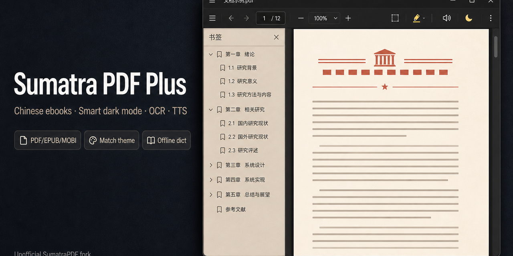

# Sumatra PDF Plus

**Unofficial fork** of [SumatraPDF](https://github.com/sumatrapdfreader/sumatrapdf) · **非官方**社区增强版  
Not affiliated with [sumatrapdfreader.org](https://www.sumatrapdfreader.org/) · 与官方站点无关

A Windows document reader (PDF, EPUB, MOBI, and more) with improvements for Chinese ebooks, offline lookup, themes, smart PDF dark mode, and local OCR.  
Windows 下的 PDF / 电子书阅读器，针对中文 EPUB/MOBI、离线查词、主题、PDF 智能暗黑模式与本地 OCR 等做了增强。

- **Repository / 本仓库：** source code for GPLv3 compliance · 满足 GPLv3 源码随同分发要求  
- **User guide (Chinese) / 中文详细说明：** [readme.txt](readme.txt)  
- **Upstream / 上游项目：** [https://github.com/sumatrapdfreader/sumatrapdf](https://github.com/sumatrapdfreader/sumatrapdf)  
- **License / 许可：** [COPYING](COPYING) (GPLv3) + [AUTHORS](AUTHORS)



---

## Features · 主要特性

**Highlights / 重点**

- **OCR** — offline RapidOCR / PP-OCR for **scanned pages**. Auto OCR while reading, recognize all pages, save a searchable PDF, or drag a region; then search, select, look up, read aloud, and extract bookmarks. Keep `{exe}\ocr\`.  
  **OCR** — **扫描页本地识别**（RapidOCR / PP-OCR）。翻页自动识别、全文识别、保存可搜索 PDF、框选识别；之后可搜索、选中、查词、朗读、提取书签。模型在 `{exe}\ocr\`。
- **Smart PDF dark mode** — Original / Match theme for PDF and ebooks; toolbar Light / Dark (Light-Warm, Light-White).  
  **智能暗黑** — 原稿 / 匹配主题（PDF、EPUB、MOBI 等）；工具栏亮/暗主题（暖色护眼、中性浅色）。
- **Read Aloud (TTS)** — word-by-word highlight; start from top, cursor, or selection; pause/continue; voice and speed 0.25×–2.0×.  
  **朗读 (TTS)** — 逐词高亮；从页首/光标/选中开始；暂停/继续；可选语音与语速。
- **Offline dictionary** — double-click a word; `.idx`/`.dat` in `{exe}\dict\`.  
  **离线查词** — 双击词语；词典放在 `{exe}\dict\`。
- **Chinese EPUB/MOBI** — mixed text/image layout; TOC navigation; faster open for large EPUB/MOBI/AZW.  
  **中文 EPUB/MOBI** — 图文混排与目录跳转；大型文件打开更快。
- **Selection toolbar** — highlight, underline, strike out, Ask AI on PDF selection.  
  **划词工具栏** — 选中后高亮、下划线、删除线、Ask AI。

**Also / 其他：** per-monitor DPI (sidebar, toolbar, menu, tabs, TOC search; tab-detach font fix) · session restore no longer crashes on double-click open · Win11-style caption and theme-aware chrome.  
**另有：** 双屏 DPI（书签/工具栏/菜单/标签/目录搜索字号；拖标签分窗字体）· 恢复会话后双击打开不再崩溃 · Win11 标题栏与主题配色。

**Supported formats / 常见格式：** PDF（含扫描件 OCR）、EPUB、MOBI、AZW/AZW3、FB2、CHM、CBZ/CBR、DjVu、XPS 等。Scanned PDF, DjVu, images, and comics can be recognized locally.  
扫描 PDF、DjVu、图片和漫画可本地 OCR。

Product name: **Sumatra PDF Plus**. Executable: `SumatraPDF-Plus.exe`.  
显示名称：**Sumatra PDF Plus**，可执行文件为 `SumatraPDF-Plus.exe`。

---

## Quick start · 快速开始

1. Extract the full folder to any path (avoid special characters in the path).
  解压整个文件夹到任意目录（路径尽量不要含特殊符号）。
2. Run `SumatraPDF-Plus.exe`. Keep the `fonts` folder beside the exe.
  双击 `SumatraPDF-Plus.exe` 运行；不要只复制 exe，请保留同目录的 `fonts` 文件夹。
   For Traditional Chinese PDF lookup, also keep the `opencc` folder.  
   繁体 PDF 查词还需保留 `opencc` 文件夹。
   For scanned-page OCR, keep the `ocr` folder (`onnxruntime.dll` and `.onnx` models).  
   扫描页 OCR 还需保留 `ocr` 文件夹（含 `onnxruntime.dll` 与模型）。
3. Use the toolbar to toggle light/dark theme and word lookup.
  可通过工具栏切换亮/暗主题和查词开关。
4. Click **Auto OCR** to recognize scanned pages as you view them, or use the dropdown for recognize-all / save / region.
  点击**自动 OCR** 可在翻页时识别扫描页；下拉菜单可全文识别、保存可搜索 PDF、或框选识别。
5. Click the **speaker** icon (after OCR) or open **Read Aloud (TTS)** in the menu bar to read aloud.
  点击工具栏**喇叭**图标（在 OCR 之后），或菜单栏 **Read Aloud (TTS)** 开始朗读。

---

## OCR · 扫描页识别

Recognize scanned pages (little or no text layer) so you can **select, search, look up words, read aloud, and extract bookmarks**. Runs **offline** with RapidOCR / PP-OCR Chinese mobile models in `{exe}\ocr\`.  
识别几乎没有文字层的扫描页，便于**选择、搜索、查词、朗读和提取书签**。使用 `{exe}\ocr\` 里的 RapidOCR / PP-OCR 中文模型，**完全离线**。

**How to use / 使用方法**

- **Toolbar / 工具栏** — **Auto OCR** (before the speaker). Click to toggle recognition as you view or search scanned pages (default **off**). Dropdown: **Recognize all pages**, **Recognize all pages and save**, **OCR region**.  
  **自动 OCR**（在喇叭按钮前）。单击后翻页即识别扫描页（默认**关**）。下拉：**全文识别**、**全文识别并保存**、**框选识别**。
- **Recognize all pages / 全文识别** — re-OCRs every page even if a text layer already exists (garbled dual-layer PDFs). Results stay in memory for this session. If there is no outline, bookmarks are extracted after OCR.  
  即使已有文字层也会再扫一遍（乱码双层 PDF）。结果先留在本次打开的文档里。没有目录时识别后提取书签。
- **Recognize all pages and save / 全文识别并保存** — scan with progress, then **overwrite the current PDF** (no Save As). Prompts before replacing an existing text layer or outline. PDF only.  
  显示进度后**直接覆盖当前 PDF**，不弹另存。已有文字层或目录时先询问。仅 PDF。
- **OCR region / 框选识别** — drag a rectangle; text is copied.  
  拖选矩形，识别结果复制到剪贴板。
- **Cancel / 取消** — stop queued jobs; pages already done are kept.  
  取消排队中的页；已识别的页保留。

Keep the `ocr` folder next to the exe. Details: [docs/md/OCR.md](docs/md/OCR.md).  
请保留 exe 同目录的 `ocr` 文件夹。详见 [docs/md/OCR.md](docs/md/OCR.md)。

Advanced setting: `AutoOcrScanPages` (default `false`).  
高级设置：`AutoOcrScanPages`（默认 `false`）。

---

## Read Aloud (TTS) · 朗读

Read documents aloud with **word-by-word highlighting** synced to speech. Works on PDF, EPUB, MOBI, and other formats with extractable text.  
**逐词高亮**跟随朗读进度，支持 PDF、EPUB、MOBI 等可提取文本的格式。

**How to use / 使用方法**

- **Toolbar / 工具栏** — speaker icon after Auto OCR; click to start/pause/continue; dropdown for voice, speed, and start options  
  OCR 按钮后的**喇叭**；单击开始/暂停/继续；下拉菜单可选语音、语速与起始方式
- **Menu bar / 菜单栏** — **Read Aloud (TTS)** → start from top, cursor, or selection; **Voice** and **Speed** submenus  
  **Read Aloud (TTS)** → 从页首/光标/选中开始；**Voice** 选语音、**Speed** 选调速
- **Right-click / 右键** — **Start Reading From Cursor Position**; **Pause Reading** / **Continue Reading** while active  
  **从光标处开始朗读**；朗读中可**暂停朗读** / **继续朗读**
- **Speed presets / 语速** — 0.25×, 0.5×, 0.75×, 1.0×, 1.25×, 1.5×, 2.0×

**Natural voices / 自然语音**

Default Windows SAPI voices (e.g. Huihui, Kangkang, Yaoyao) sound robotic. For natural speech, install **[NaturalVoiceSAPIAdapter](https://github.com/gexgd0419/NaturalVoiceSAPIAdapter)** and configure local Narrator voices or Edge online voices — see [docs/md/Read-Aloud-TTS.md](docs/md/Read-Aloud-TTS.md).  
系统默认 SAPI 语音（如慧慧、康康、瑶瑶）较机械。自然语音需安装 **[NaturalVoiceSAPIAdapter](https://github.com/gexgd0419/NaturalVoiceSAPIAdapter)**，详见 [docs/md/Read-Aloud-TTS.md](docs/md/Read-Aloud-TTS.md)。

Advanced settings: `ReadAloudVoiceId`, `ReadAloudSpeakingRate`.  
高级设置：`ReadAloudVoiceId`（语音）、`ReadAloudSpeakingRate`（语速）。

---

## Offline dictionary · 离线查词

Dictionary **code** is in this repo;   
查词**功能代码**在本仓库；

1. Create `{exe}\dict\` next to the executable.
  在 exe 同目录建立 `dict` 文件夹。
2. Add dictionary files, for example:
  放入词典文件，例如：
  - `SumatraDict.idx` / `SumatraDict.dat /` `SumatraDictAudio.dat`— English–Chinese · 英汉
  - `SumatraDictZh.idx` / `SumatraDictZh.dat` — Chinese dictionary · 汉语
3. Enable the dictionary button on the toolbar, then double-click a word in the document.
  打开工具栏「查词」按钮，在正文中双击词语即可。

Override the dictionary folder with the `OfflineDictionaryPath` advanced setting.  
可用高级设置 `OfflineDictionaryPath` 指定其他词典目录。

**Traditional Chinese PDF lookup / 繁体 PDF 查词** — keep the `opencc` folder next to the exe (OpenCC t2s data). Upgrading only the exe without `opencc` disables Traditional lookup.  
繁体 PDF 查词需保留 exe 同目录的 `opencc` 文件夹；只升级 exe 将无法繁体查词。

---

## Settings · 配置文件

Settings are stored in `SumatraPDF-settings.txt`:

- **Portable / 便携版:** next to `SumatraPDF-Plus.exe`
- **Installed / 安装版:** `%LOCALAPPDATA%\SumatraPDF\SumatraPDF-settings.txt`

**Annotated reference / 带中文注释的参考模板:** [SumatraPDF-settings-annotated.txt](SumatraPDF-settings-annotated.txt)

Copy only the lines you need into your live settings file. Comments must be on their own `#` lines (inline comments after values are not supported).  
只复制需要的配置行到真实配置文件；注释必须单独成行，不能写在值后面。

User guide (Chinese) / 中文说明: [readme.txt](readme.txt)

---

## Build · 编译 (Windows)

Requirements: Visual Studio 2022 build tools, [Bun](https://bun.sh).

```powershell
bun ./cmd/build.ts          # debug → out/dbg64/SumatraPDF-Plus.exe
bun ./cmd/build-all.ts      # release → out/rel64/
```

See [AGENTS.md](AGENTS.md) for contributor notes.  
贡献者说明见 [AGENTS.md](AGENTS.md)。

---

## Feedback · 反馈

Bug reports and pull requests are welcome **on this repository only** — not on the official SumatraPDF issue tracker.  
欢迎在本仓库提交 Issue 和 PR，请勿发到官方 SumatraPDF 项目。

When reporting problems, please include the file type, book title (if ebook), and steps to reproduce.  
反馈问题时请说明文件类型、书名（电子书）和复现步骤。

---

## Disclaimer · 免责声明

Sumatra PDF Plus is a community modification for testing and personal use.  
Sumatra PDF Plus 为基于 GPLv3 的社区修改版，供测试与个人使用。

---

## Upstream SumatraPDF

[Build](https://github.com/sumatrapdfreader/sumatrapdf/actions/workflows/build.yml)

SumatraPDF is a multi-format reader for Windows under (A)GPLv3, with some code under BSD license (see [AUTHORS](AUTHORS)).

- [Website](https://www.sumatrapdfreader.org/free-pdf-reader)
- [Manual](https://www.sumatrapdfreader.org/manual)
- [Developer Information](https://www.sumatrapdfreader.org/docs/Contribute-to-SumatraPDF)
